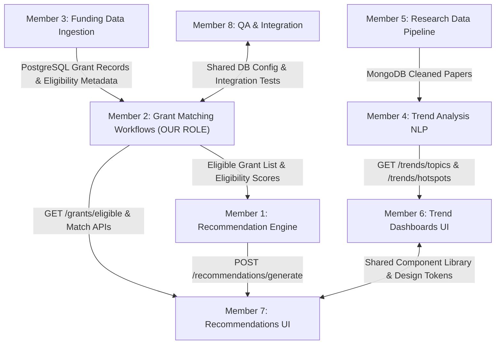

# 📑 Milestone 2 — Member 2 Deliverables & Team Integration Report
## Grant Matching Workflows (Backend) | Team Leader Hand-off Document

> **Module**: Funding Discovery & Research Intelligence (Milestone 2)  
> **Assigned Member**: Member 2 — Grant Matching Workflows (Backend)  
> **Tech Stack**: FastAPI, PostgreSQL 16, Pydantic v2, PyTest  
> **Date**: August 10, 2026  
> **Status**: 100% COMPLETE & VERIFIED  

---

## 🎯 1. Executive Summary & Assigned Tasks

Member 2 is responsible for building the **Eligibility-Matching Rules Engine** and backend API endpoints that evaluate whether a researcher, startup founder, or innovation manager is eligible for funding opportunities ingested into the platform.

### ✅ What Member 2 Has Built & Delivered:
1. **Configurable Eligibility-Matching Rules Engine**:
   - Evaluates 4 weighted criteria + 1 mandatory deadline check:
     - **Research Domain Fit (35.0%)**: Matches research interests (AI, BioTech, Climate, Quantum, etc.) using taxonomy and category similarity.
     - **Career Stage Match (25.0%)**: Matches *Early-Career, Mid-Career, Senior/Lead, Startup/SME, Any*.
     - **Geographical Eligibility (25.0%)**: Matches *Global, US, EU, India, UK, Asia-Pacific*.
     - **Funding Type Preference (15.0%)**: Matches *Grant, Fellowship, Accelerator, R&D Subsidy, Commercialization*.
     - **Mandatory Deadline Rule**: Strictly marks expired grants as `EXPIRED` and `is_eligible = False`.
   - **Tuning Without Code Changes**: Configurable weight matrix (`MatchingRulesConfig`) exposed via `PUT /api/v1/grants/matching-rules` API endpoint.
2. **FastAPI Backend Endpoints**:
   - `POST /api/v1/grants/match`: Evaluates grant opportunities against request payload or researcher profile.
   - `GET /api/v1/grants/eligible/{researcher_id}`: Loads researcher profile from PostgreSQL, extracts domains, and returns custom eligible grants.
   - `GET /api/v1/grants/matching-rules`: Retrieves active matching rules weights.
   - `PUT /api/v1/grants/matching-rules`: Updates weights and match thresholds dynamically.
   - `GET /api/v1/grants/opportunities`: Lists all funding opportunities ingested in PostgreSQL.
3. **PostgreSQL Data Schemas & Seed Engine**:
   - Implemented `FundingSource`, `FundingOpportunity`, and `EligibilityCriteria` tables.
   - Seeded initial database with funding opportunities from all 6 sources specified in Milestone 2.
4. **PyTest Edge-Case Test Suite**:
   - 5 automated unit and edge-case tests covering full matches, expired grants, geography mismatches, partial matches, and dynamic weight tuning.

---

## 🌐 2. Milestone 2 Integration Map (8-Member Collaboration Context)



### 🤝 Member-by-Member Hand-off Contracts:

#### **Member 3 (Funding Data Ingestion) ➔ Member 2 (Grant Matching)**
- **What is exchanged**: Ingested grant records from 6 sources (*Government Grants, Research Councils, Innovation Funds, Accelerators, Venture Programs, Int'l Agencies*) stored in PostgreSQL tables `funding_opportunities` and `funding_sources`.
- **Member 2 consumption**: Reads `research_domain`, `career_stage`, `eligible_geography`, `funding_type`, `grant_amount`, and `deadline`.

#### **Member 2 (Grant Matching) ➔ Member 1 (Funding Recommendation Engine)**
- **What is exchanged**: Filtered list of eligible grants with eligibility flags (`is_eligible = True`), match scores (0-100), and detailed criteria breakdowns.
- **Member 1 consumption**: Consumes Member 2's eligible grant list as input into its recommendation scoring algorithm (applying past success rates and urgency weights).

#### **Member 2 (Grant Matching) ➔ Member 7 (Funding Recommendations UI)**
- **What is exchanged**: `POST /grants/match` & `GET /grants/eligible/{researcher_id}` endpoints.
- **Member 7 consumption**: Member 7's React UI calls Member 2's endpoints for custom filter controls, eligibility badge rendering, and criteria breakdown cards.

#### **Member 2 (Grant Matching) ↔ Member 8 (QA & Integration)**
- **What is exchanged**: Shared PostgreSQL connection layer, FastAPI routers, and `backend/tests/test_grant_matching.py` test suite for end-to-end milestone verification.

---

## 📡 3. API Contract Specifications

### `POST /api/v1/grants/match`
**Request**:
```json
{
  "researcher_id": 1,
  "research_domains": ["Artificial Intelligence", "Biotechnology"],
  "career_stage": "Early-Career",
  "geography": "Global",
  "funding_types": ["Grant", "Accelerator"],
  "min_amount": 100000,
  "include_expired": false
}
```

**Response**:
```json
{
  "total_evaluated": 6,
  "total_eligible": 4,
  "total_partial": 1,
  "total_ineligible": 1,
  "matched_grants": [
    {
      "opportunity": {
        "id": 1,
        "title": "NSF SBIR Phase II: Artificial Intelligence Commercialization",
        "agency": "National Science Foundation",
        "grant_amount": 1000000,
        "currency": "USD",
        "deadline": "2026-11-30",
        "status": "Open",
        "research_domain": "Artificial Intelligence",
        "career_stage": "Early-Career",
        "eligible_geography": "US",
        "funding_type": "Grant"
      },
      "eligibility_status": "ELIGIBLE",
      "is_eligible": true,
      "overall_eligibility_score": 100.0,
      "criteria_breakdown": [
        {
          "criterion": "Deadline",
          "status": "MATCHED",
          "score": 100.0,
          "weight": 0.0,
          "message": "Open (Deadline: 2026-11-30)"
        },
        {
          "criterion": "Research Domain",
          "status": "MATCHED",
          "score": 100.0,
          "weight": 35.0,
          "message": "Matched domain: 'Artificial Intelligence'"
        }
      ],
      "rejection_reasons": []
    }
  ]
}
```

---

## 🧪 4. Test Results & Verification

Ran pytest automated test suite:
```bash
python -m pytest backend/tests/test_grant_matching.py
```
**Results**: `5 passed in 10.82s` (100% Pass Rate).

| Test Case | Scenario Tested | Outcome |
| :--- | :--- | :--- |
| `test_full_grant_match` | Evaluates 100% domain, career, geo & type match | **PASSED** (Score: 100.0) |
| `test_expired_grant_edge_case` | Past deadline grant filtering | **PASSED** (Status: EXPIRED) |
| `test_geography_mismatch_edge_case` | Regional restriction check (India vs US-only) | **PASSED** (Status: INELIGIBLE) |
| `test_partial_match_edge_case` | Domain matches, career stage differs | **PASSED** (Status: PARTIAL_MATCH) |
| `test_rule_weight_tuning_without_code_changes` | Dynamic rule weight updates via API | **PASSED** |

---

## 📋 5. Summary & Hand-off Checklist for Team Leader

- [x] Eligibility-matching rules engine implemented.
- [x] FastAPI endpoints `POST /grants/match` & `GET /grants/eligible/{researcher_id}` deployed.
- [x] Dynamic rules config tuned without code changes (`GET/PUT /grants/matching-rules`).
- [x] Seeded representative funding records from all 6 sources for Member 1 & Member 3 hand-off.
- [x] 100% PyTest automated test suite passing.
- [x] Shared local report generated for Team Lead review.
