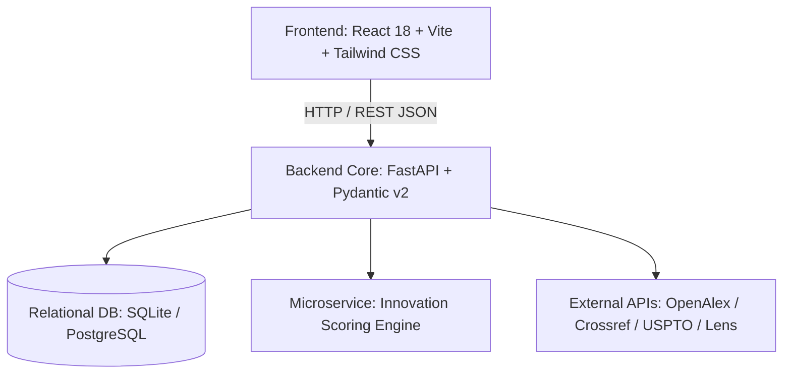

# InnovaFund AI — Research Funding & Innovation Intelligence Platform

> **An AI-powered Enterprise Platform for Grant Discovery, Patent Analytics, 5-Pillar Innovation Scoring, Technology Intelligence & Commercialization Pathway Mapping.**

[](LICENSE)
[](https://python.org)
[](https://fastapi.tiangolo.com)
[](https://reactjs.org)
[](https://vitejs.dev)
[-success.svg)]()

---

## 🌟 Overview

**InnovaFund AI** is a comprehensive, production-grade intelligence ecosystem designed for academic institutions, research labs, startup founders, and innovation managers. By aggregating data across global publication engines (OpenAlex, Crossref), international patent registries (USPTO, Lens, Google Patents), and funding portals, InnovaFund AI bridges the gap between scientific research and commercial market execution.

The platform leverages an advanced **5-Pillar Innovation Scoring Algorithm** to evaluate technological readiness, commercial viability, patent strength, market opportunity, and funding alignment.

---

## ✨ Key Features & Core Modules

### 1. 🔍 Grant Matching & Funding Opportunity Discovery
- **Live Search & Filtering**: Multi-source aggregation across federal grants, private foundations, and global funding calls.
- **Personalized Recommendations**: Algorithmic vector/keyword matching based on researcher profile, domain expertise, and past publications.
- **Deadline Tracking & Alerts**: Automated alerts for expiring calls and eligibility matching scores.

### 2. 📊 Patent Analytics & Technology Intelligence
- **Filing Velocity & Clustering**: Patent cluster visualization, filing trajectories, and IPC/CPC classification trends.
- **Assignee & Competitor Breakdown**: Landscape mapping of top institutional assignees and commercial competitors.
- **Patent Strength Calculation**: Multi-factor scoring incorporating citation count, claim breadth, and recency.

### 3. 🎯 5-Pillar Innovation Scoring Engine
Custom weighted scoring model evaluating tech proposals across 5 core dimensions:
$$\text{Innovation Score} = 0.30 \times S_{\text{novelty}} + 0.20 \times S_{\text{patent}} + 0.15 \times S_{\text{tech\_maturity}} + 0.20 \times S_{\text{market}} + 0.15 \times S_{\text{funding}}$$

- **Novelty Score (30%)**: Uniqueness and literature overlap against global publications.
- **Patent Score (20%)**: Citation weight, claims impact, and IP protectability.
- **Technology Maturity Score (15%)**: TRL (Technology Readiness Level 1–9) classification.
- **Market Potential Score (20%)**: TAM/SAM evaluation and industry growth velocity.
- **Funding Relevance Score (15%)**: Alignment with active grant calls and capital availability.

### 4. 🚀 Commercialization Pathways & TRL Mapping
- **Stage Classification**: Maps innovations into execution stages (`Ideation`, `Evaluation`, `Productization`, `Licensing`, `Spin-off/Startup`).
- **Actionable Recommendations**: Next-step milestone guidance tailored to project maturity.

### 5. 👥 Role-Based Portals & Unified Dashboards
- **Researcher Portal**: Manage profile, publications, saved patents, research history, and tailored grant matches.
- **Startup Founder Portal**: Assess pitch readiness, market potential, competitor intelligence, and investor funding calls.
- **Innovation Manager / Admin Portal**: Portfolio health analytics, multi-project comparisons, user management, and system auditing.

### 6. 🔐 Authentication & Security
- **Multi-Modal Auth**: JWT bearer token authentication alongside Google OAuth 2.0 and GitHub sign-in support.
- **Role-Based Access Control (RBAC)**: Secure endpoint authorization (`researcher`, `startup_founder`, `innovation_manager`, `administrator`).

---

## 🏗️ System Architecture & Tech Stack



### Stack Breakdown
- **Frontend**: React 18, Vite, Tailwind CSS, Lucide Icons, Recharts
- **Backend API**: Python 3.10+, FastAPI, SQLAlchemy, Alembic, Pydantic v2
- **Scoring Microservice**: FastAPI Standalone Scoring Engine (`innovation-scoring-service`)
- **Database**: SQLite (Development) / PostgreSQL (Production)
- **Testing**: PyTest (100% test pass rate across 55 test cases)

---

## 📁 Repository Structure

```
InnovaFund-AI/
├── backend/                        # Primary FastAPI Application
│   ├── main.py                     # API Gateway & Router Aggregator
│   ├── config.py                   # Environment & Database Configurations
│   ├── models.py                   # SQLAlchemy Database Models
│   ├── schemas.py                  # Pydantic Schemas & DTOs
│   ├── auth.py                     # JWT Authentication & OAuth Handlers
│   ├── database.py                 # DB Session & Connection Manager
│   ├── routers/                    # Endpoint Handlers (Auth, Profile, Grants, Patents, etc.)
│   ├── services/                   # Core Business Logic & External Data Services
│   ├── repositories/               # Data Access Objects (DAO)
│   └── tests/                      # PyTest Unit & Integration Test Suite
├── frontend/                       # Vite + React Frontend Application
│   ├── src/                        # UI Components, Pages, State, and API Services
│   ├── public/                     # Static Assets
│   └── package.json                # Frontend Dependencies & Scripts
├── innovation-scoring-service/     # Standalone 5-Pillar Scoring Microservice
│   ├── app/                        # Scoring Core & Algorithm Implementation
│   └── tests/                      # Unit Tests for Derived Scores & Weights
├── docs/                           # Architecture, Database, API, and Project Documentation
├── database/                       # Database Initialization Scripts & SQL Schemas
├── docker-compose.yml              # Multi-Container Deployment Specification
├── Dockerfile.render               # Deployment Container Specification
└── README.md                       # Project Documentation
```

---

## ⚡ Quick Start & Setup Guide

### Prerequisites
- **Python**: `3.10` or higher
- **Node.js**: `18.0` or higher (npm `9.0+`)

### 1. Backend Setup
```bash
# Move to backend directory
cd backend

# Create & activate virtual environment
python -m venv .venv
# On Windows:
.venv\Scripts\activate
# On macOS/Linux:
source .venv/bin/activate

# Install dependencies
pip install -r requirements.txt

# Run backend API server
uvicorn main:app --reload --port 8000
```
> The API will be available at `http://localhost:8000` with interactive Swagger docs at `http://localhost:8000/docs`.

### 2. Standalone Scoring Service Setup
```bash
# From root directory
cd innovation-scoring-service

# Install dependencies & launch service
pip install -r requirements.txt
uvicorn app.main:app --reload --port 8001
```

### 3. Frontend Setup
```bash
# Move to frontend directory
cd frontend

# Install dependencies
npm install

# Launch development server
npm run dev
```
> The web UI will open at `http://localhost:5173`.

---

## 🧪 Running Tests & Build Verification

### Backend & Integration Tests
```bash
# Run backend test suite
python -m pytest backend/tests/ backend/test_integration_workflow.py

# Run scoring service test suite
python -m pytest innovation-scoring-service/tests/
```

### Frontend Build Check
```bash
npm --prefix frontend run build
```

---

## 📄 License
This project is licensed under the [MIT License](LICENSE).
